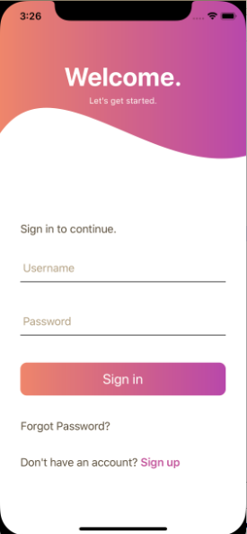
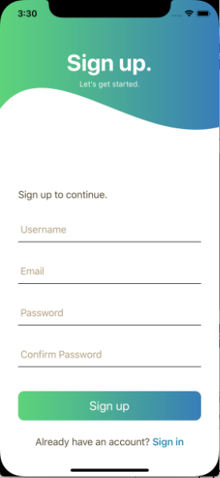
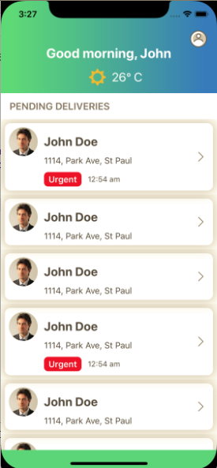
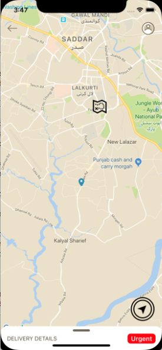
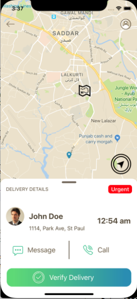
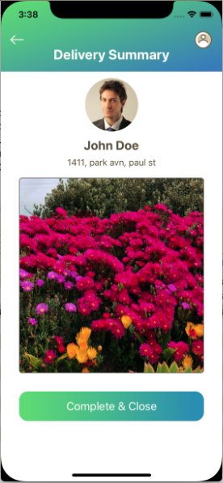

# iOS  Task

This project contains the UI implementation and other functionalities of Delivery System. 


## Screenshots














##  Requirements

* macOS 10.13.5
* XCode 9.4.1
* Swift 4


## How to run the project?

* Clone this repo
* Open shell window and navigate to project folder
* Run pod install
* Open driver.xcworkspace and run the project on selected device or simulator


## Features

- [x] Signin UI
- [x] SignUp UI
- [x] View the list of tasks (pending deliveries) assigned
- [x] Select and view the detail of each task
- [x] View customer’s information
- [x] Call the customer
- [x] Send a Message to customer
- [x] See the route/path from driver’s current location to the customer on a map. (Every task has a location of the customer where delivery is to perform)
- [x] Open turn by turn navigation (open default maps app when tapped on a Navigation button that should start a navigation from source to destination)
- [x] Complete the task by taking a picture of the receipt using camera or selecting from the gallery

## Architecture

"Model View Controller" approach is used in development of this project

### Model
Model objects encapsulate the data specific to an application and define the logic and computation that manipulate and process that data.

### View
A view is an object in an application that users can see. A view knows how to draw itself and can respond to user actions. A major purpose of view is to display data from the application’s model objects and to enable the editing of that data

### Controller
A controller acts as an intermediary between one or more of an application’s view and one or more of its model. Controller are thus a conduit through which view objects learn about changes in model objects and vice versa. Controller can also perform setup and coordinating tasks for an application and manage the life cycles of other objects.


# Pods

### GoogleMaps
Google Maps SDK for iOS and Google Places API for iOS .
### IQKeyboardManagerSwift
Universal library allows to prevent issues of keyboard sliding up and cover UITextField/UITextView. 
### ACFloatingTextfield-Swift
It is a subclass of UITextfield to Provide the floating label and customisations. 
### GRView
UIView and other UIKit elements with a gradient and other attributes for IOS .


##  Version
Current Version ```1.0```

## Developed By
Zeeshan Tariq.
